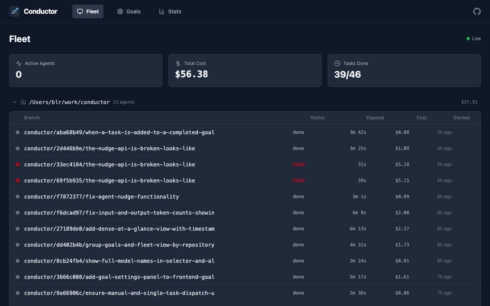
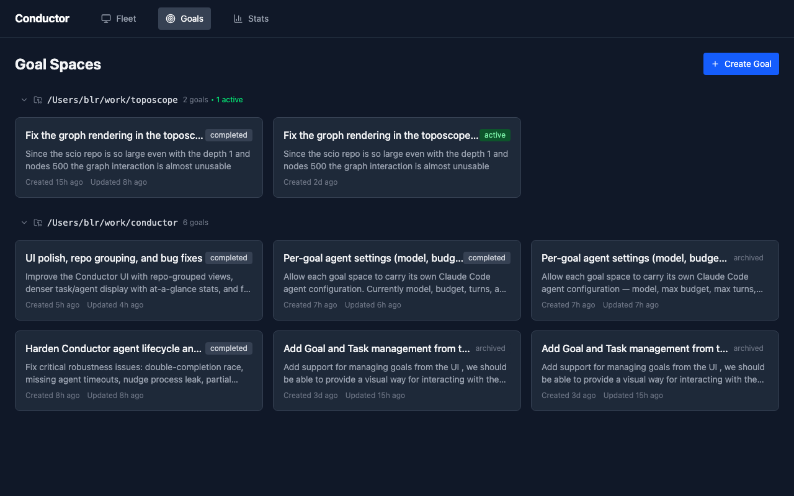

# Conductor

Local-first orchestration system for managing multiple Claude Code agents in parallel. Define a goal, decompose it into tasks, and let Conductor spawn and coordinate agents across isolated git worktrees.


## Screenshots

### Fleet View
Real-time overview of all agents across repositories, with status, cost tracking, and elapsed time.



### Goal Spaces
Group work by goal. Each goal is decomposed into tasks with dependency ordering, then dispatched to agents automatically.



## How It Works

1. **Create a goal** - Describe what you want to accomplish and point at a repo
2. **Decompose** - Conductor uses Claude to break the goal into ordered tasks with dependencies
3. **Dispatch** - Each task gets its own Claude Code agent running in an isolated git worktree
4. **Monitor** - Watch agents work in real-time via the web UI or CLI
5. **Merge** - Completed work lands on branches ready for review

Each agent runs as a headless `claude -p --output-format stream-json` process. Conductor parses the event stream, tracks tool usage, costs, and status, and auto-dispatches dependent tasks as predecessors complete.

## Installation

### Homebrew

```sh
brew tap rahul-roy-glean/devtools
brew install conductor
```

### From Source

```sh
git clone https://github.com/rahul-roy-glean/conductor.git
cd conductor
make build
make install  # copies to /usr/local/bin
```

### Prerequisites

- [Claude Code](https://docs.anthropic.com/en/docs/claude-code) (`npm install -g @anthropic-ai/claude-code`)
- Authenticated via `claude` CLI

## Quick Start

```sh
# Start the server (UI included at http://localhost:3001)
conductor server

# Or start and open the browser
conductor ui
```

### CLI Workflow

```sh
# Create a goal
conductor goal create "Add user authentication with JWT" --repo /path/to/project

# Decompose into tasks
conductor goal decompose <goal-id>

# Dispatch agents
conductor goal dispatch <goal-id>

# Monitor
conductor status
conductor logs <agent-id>

# Interact with a running agent
conductor nudge <agent-id> "Focus on the middleware first"
conductor kill <agent-id>
```

## Architecture

```
                    +------------------+
                    |   Web UI (React) |
                    |   :3001          |
                    +--------+---------+
                             |
                    +--------+---------+
                    |  Axum HTTP + SSE |
                    |  REST API        |
                    +--------+---------+
                             |
              +--------------+--------------+
              |              |              |
     +--------+---+  +------+------+  +----+-------+
     | Agent      |  | Goal/Task   |  | SQLite DB  |
     | Manager    |  | Decomposer  |  |            |
     +--------+---+  +-------------+  +------------+
              |
     +--------+---+--------+--------+
     |            |        |        |
  +--+--+     +--+--+  +--+--+  +--+--+
  |agent|     |agent|  |agent|  |agent|
  |wt/1 |     |wt/2 |  |wt/3 |  |wt/4 |
  +-----+     +-----+  +-----+  +-----+
  (worktrees in /tmp/conductor/)
```

### Key Components

| Module | Purpose |
|--------|---------|
| `src/agent/session.rs` | Spawns and monitors Claude Code processes |
| `src/agent/worktree.rs` | Creates isolated git worktrees per agent |
| `src/agent/event_parser.rs` | Parses Claude Code's stream-json output |
| `src/goal/decompose.rs` | Uses Claude to break goals into tasks |
| `src/server/routes.rs` | REST API + embedded frontend serving |
| `src/server/sse.rs` | Real-time event streaming to UI |
| `src/db/` | SQLite persistence for goals, tasks, agents, events |
| `src/hooks/` | Claude Code hooks for agent lifecycle callbacks |

### Agent Lifecycle

1. Task is dispatched -> worktree created from repo
2. `claude -p` process spawned with task prompt
3. Event stream parsed in real-time (tool calls, text, costs)
4. On completion: status updated, dependent tasks unblocked
5. Auto-dispatch picks up newly unblocked tasks

### Per-Goal Settings

Each goal space can configure its agents:

| Setting | Default | Description |
|---------|---------|-------------|
| `model` | `sonnet` | Claude model to use |
| `max_budget_usd` | `5.0` | Max spend per agent |
| `max_turns` | `100` | Max conversation turns |
| `allowed_tools` | all | Restrict tool access |
| `permission_mode` | none | Claude Code permission mode |
| `system_prompt` | none | Custom system prompt |

Task-level settings override goal-level settings.

## API

All endpoints are under `/api/`. The server also serves the embedded React UI at the root path.

### Goals
```
POST   /api/goals                    Create goal space
GET    /api/goals                    List all goals
GET    /api/goals/:id                Get goal details
PUT    /api/goals/:id                Update goal
DELETE /api/goals/:id                Archive goal
POST   /api/goals/:id/decompose      Decompose into tasks
POST   /api/goals/:id/dispatch       Dispatch agents for tasks
GET    /api/goals/:id/tasks          List tasks
POST   /api/goals/:id/tasks          Create task
POST   /api/goals/:id/retry-failed   Retry all failed tasks
```

### Tasks
```
PUT    /api/tasks/:id                Update task
POST   /api/tasks/:id/retry          Retry task
POST   /api/tasks/:id/dispatch       Dispatch agent for task
```

### Agents
```
GET    /api/agents                   List all agents
GET    /api/agents/:id               Get agent details
POST   /api/agents/:id/nudge         Send message to running agent
POST   /api/agents/:id/kill          Terminate agent
GET    /api/agents/:id/events        Get agent events
```

### Streaming
```
GET    /api/events                   Global SSE event stream
GET    /api/agents/:id/stream        Per-agent SSE stream
```

## Development

```sh
# Run frontend dev server + backend in parallel
make dev

# Run all checks
make lint     # clippy + eslint
make check    # formatting (cargo fmt + prettier)
make test     # cargo test + vitest

# Install git pre-commit hook
make setup-hooks
```

### Project Structure

```
conductor/
├── src/                        # Rust backend
│   ├── agent/                  # Claude Code process lifecycle
│   ├── server/                 # HTTP API, SSE, embedded UI
│   ├── goal/                   # Goal decomposition & task management
│   ├── db/                     # SQLite schema & queries
│   ├── hooks/                  # Claude Code hooks integration
│   └── cli.rs                  # CLI commands
├── frontend/                   # React + Vite + TypeScript + Tailwind
│   └── src/
│       ├── components/         # UI components
│       ├── hooks/              # Custom React hooks (SSE streaming)
│       └── api/                # API client
├── tests/                      # Integration tests
├── .github/workflows/          # CI and release pipelines
├── deny.toml                   # cargo-deny config
└── Makefile                    # Build commands
```

## CI

The CI pipeline runs 8 parallel jobs on every push and PR:

| Job | Check |
|-----|-------|
| Rustfmt | `cargo fmt -- --check` |
| Clippy | `cargo clippy -- -D warnings` |
| Tests | `cargo test` |
| MSRV | `cargo check` with Rust 1.83 |
| Cargo Deny | License audit, security advisories |
| Frontend Build | TypeScript + Vite build |
| Frontend Lint | Prettier + ESLint |
| Frontend Tests | Vitest |

## Release

Pushing a version tag triggers cross-platform binary builds:

```sh
make release  # tags vX.Y.Z from Cargo.toml and pushes
```

Builds for:
- macOS ARM (aarch64-apple-darwin)
- macOS Intel (x86_64-apple-darwin)
- Linux x86_64 (x86_64-unknown-linux-gnu)

## Running as a Service

```sh
# With Homebrew
brew services start conductor

# With launchd manually
conductor server  # runs on port 3001
```

## License

MIT
